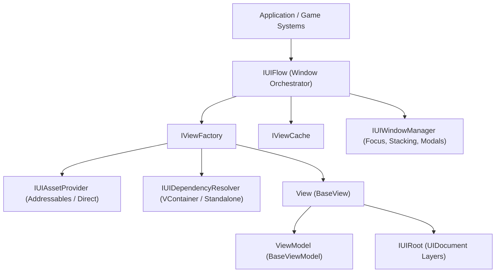

# 🏛️ SUIF Architecture Manual

> **SUIF (Scalable UI Framework)** is an ultra-performant, modular, declarative MVVM UI Toolkit framework engineered specifically for **Unity 6+**.

---

## 📐 High-Level Architecture Overview

---

## 🧱 Core Subsystems

### 1. MVVM & Separation of Concerns
* **View (`BaseView<TViewModel>`)**: Pure UI Toolkit binding logic. Responsible for querying UXML elements, attaching USS classes, and setting up data-bindings. Views are never MonoBehaviours!
* **ViewModel (`BaseViewModel`)**: Pure C# POCO classes containing state and business logic. Cleanly decoupled from `UnityEngine.UIElements`.
* **Binding Layer (`ViewBinder`)**: Zero-allocation reactive bridge between ViewModel and View.

### 2. Scoped Window Lifecycle & Layers
Windows are assigned to distinct layers via the `[UIView]` attribute:
* `UILayer.Background`: Underlays and background canvases.
* `UILayer.Screens`: Fullscreen views (HUD, Main Menu, Inventory screen).
* `UILayer.Windows`: Floating, stackable windows (Character stats, Quest log).
* `UILayer.Popups`: Modals, confirmation dialogs, alerts.
* `UILayer.Topmost`: Tooltips, notifications, loading spinners.

### 3. Focus & Modal Management
The `UIWindowManager` tracks window focus automatically:
* Brings clicked windows to the front within their respective layer.
* Manages `is-active` and `is-inactive` USS states for visual elevation.
* Automatically creates and animates `ModalBlocker` UXML overlays for modal views.

### 4. Dependency Inversion & Modularity
The framework isolates external dependencies using modular assembly definitions:
* **`SUIF.Core`**: Pure zero-dependency baseline.
* **`SUIF.VContainer`**: Activates automatically when `jp.hadashikick.vcontainer` is present.
* **`SUIF.Addressables`**: Activates automatically when `com.unity.addressables` is present.
* **`SUIF.R3`**: Activates reactive extensions when `R3` is available.
